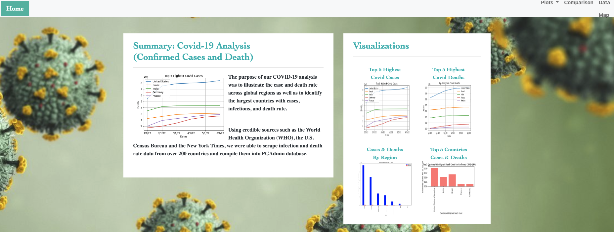
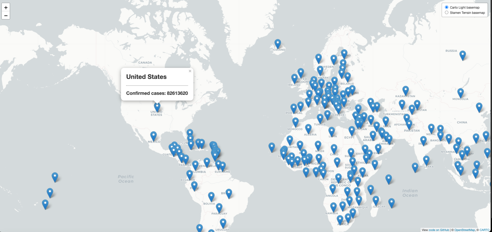

# Project 3: Global Covid Cases and Deaths Dashboard

* https://paozmoreno.github.io/Project_3/
* https://paozmoreno.github.io/Project_3/leaflet/

##### Team Members: Estela Perez, Paola Moreno, Ramiro Cervantes, Osamu Adler

##

## Background
The purpose of our project is to create a dashboard for Global COVID-19 cases and deaths, from December 31, 2019-PRESENT
https://www.census.gov/data-tools/demo/idb/#/table?COUNTRY_YEAR=2022&COUNTRY_YR_ANIM=2022&ANIM_PARAMS=2019,2022,3&menu=tableViz&TABLE_RANGE=2019,2022&TABLE_YEARS=2019,2020,2021,2022&TABLE_USE_RANGE=Y&TABLE_USE_YEARS=Y&TABLE_STEP=1&TABLE_ADD_YEARS=2022

World Health Organization 
https://covid19.who.int/data
https://covid19.who.int/table

State COVID-19 Data and Policy Actions
https://www.kff.org/coronavirus-covid-19/issue-brief/state-covid-19-data-and-policy-actions/

## Our Initial Webpage

https://paozmoreno.github.io/Project_3/flask/templates/

## Dashboard

https://paozmoreno.github.io/Project_3/visualizations/Comparisons.html

## Leaflet Map

https://paozmoreno.github.io/Project_3/leaflet/

